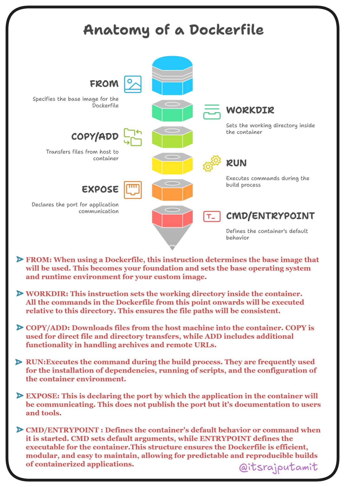

### **Docker Compose**: 
Define and manage multi-container applications.
### **Docker Multi-Stage Builds**: 
Optimize Docker images by using multiple build stages.
### **Docker Network Fundamentals**: 
Learn how containers communicate with each other and the outside world.
### **Traefik Proxy**: 
A modern reverse proxy and load balancer for microservices. [Traefik Quick Start Guide](https://doc.traefik.io/traefik/getting-started/quick-start/)
### **NGINX**: 
A popular web server and reverse proxy often used in Docker environments.