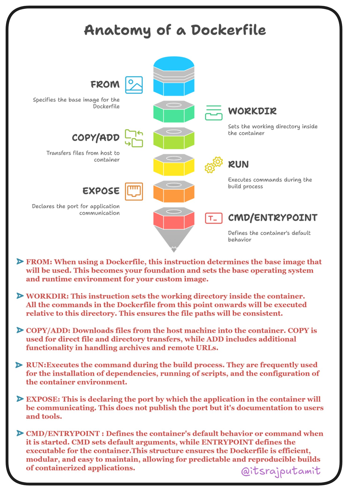

# **Learning and Playing Around with Docker**

## **Overview**
Docker is a platform for building, shipping, and running applications using **containerization**. It allows developers to package applications and their dependencies into lightweight, portable containers that can run consistently across different environments. Containers are isolated from the host system and other containers, providing a secure and consistent runtime environment. Due to their lightweight nature, containers are highly efficient and can be spun up or torn down in seconds.

Docker is not just for deployment—it’s also a powerful tool for **development** and **testing**. It enables developers to:
- Set up and tear down environments quickly.
- Test various configurations.
- Experiment without risking the stability of the host system.

---
## **Docker Security**
While containerization has existed for decades, Docker (introduced in 2013) popularized it, making it a cornerstone of modern development. However, with its adoption comes the need for robust security practices. Here’s why container security is critical:

1. **Isolation**: Containers provide an extra layer of protection by isolating applications from the host system and other containers. This helps limit the spread of malware or security threats.
2. **Vulnerability Scanning**: Tools can detect vulnerabilities in container environments, such as outdated software, misconfigurations, or insecure dependencies.
3. **Automation**: Platforms like Kubernetes automate security policies and configurations, ensuring consistent enforcement.
4. **Compliance**: Organizations must meet compliance requirements, and container security plays a key role in achieving this.
5. **Cloud-Native Applications**: Container security is essential for securing cloud-native applications, which rely heavily on containers.

---

## **Docker Terminologies**
Here are the key Docker concepts you need to know:

### **Dockerfile**
- A text file that defines how to build a Docker image.
- Contains instructions for creating a lightweight, standalone, and executable package for running applications.
- Enables consistent and repeatable image creation.

### **Docker Images**
- Read-only templates used to create Docker containers.
- Serve as the building blocks for containers.
- Can be pulled from public or private repositories (e.g., Docker Hub).

### **Container**
- A runtime instance of a Docker image.
- Packages an application’s code, dependencies, and libraries.
- Solves the "it works on my machine" problem by ensuring consistency across environments.

### **Docker Repository**
- A storage and distribution system for Docker images.
- Can be hosted on public (e.g., Docker Hub) or private registries.
- Speeds up CI/CD pipelines by providing a central repository for images.

### **Docker Volume**
- A mechanism for persistent data storage in Docker containers.
- Ensures data persists even if a container is destroyed or crashes.

### **Docker Compose**
- A tool for defining and running multi-container Docker applications.
- Uses a YAML file to configure application services, networks, and volumes.

### **Docker Hub**
- A cloud-based registry service for storing and sharing Docker images.
- Acts as a central repository for collaboration within the container community.

### **Docker Daemon (`dockerd`)**
- A background process that manages Docker objects (containers, images, volumes, networks, etc.).
- Stores all Docker-related data in a single directory.

### **Orchestration**
- The process of automating the deployment, management, and scaling of containerized applications.
- Examples: Kubernetes, Docker Swarm, Red Hat OpenShift.

---

## **Dockerfile**

## **Docker Compose**: 
Define and manage multi-container applications.
## **Docker Multi-Stage Builds**: 
Optimize Docker images by using multiple build stages.
## **Docker Network Fundamentals**: 
Learn how containers communicate with each other and the outside world.
## **Traefik Proxy**: 
A modern reverse proxy and load balancer for microservices. [Traefik Quick Start Guide](https://doc.traefik.io/traefik/getting-started/quick-start/)
## **NGINX**: 
A popular web server and reverse proxy often used in Docker environments.

---

## **CI/CD (Continuous Integration/Continuous Deployment)**
- **GitHub Actions**: Automate workflows for building, testing, and deploying Docker containers.
- **Jenkins**: A powerful automation server for CI/CD pipelines, including Docker-based workflows.

---

## **Container Orchestration**
- **Kubernetes**: The most popular container orchestration platform for automating deployment, scaling, and management of containerized applications.

---

## **Infrastructure as Code (IaC)**
- **Terraform**: A tool for defining and provisioning infrastructure using code. Often used to manage Docker environments and orchestration platforms like Kubernetes.

