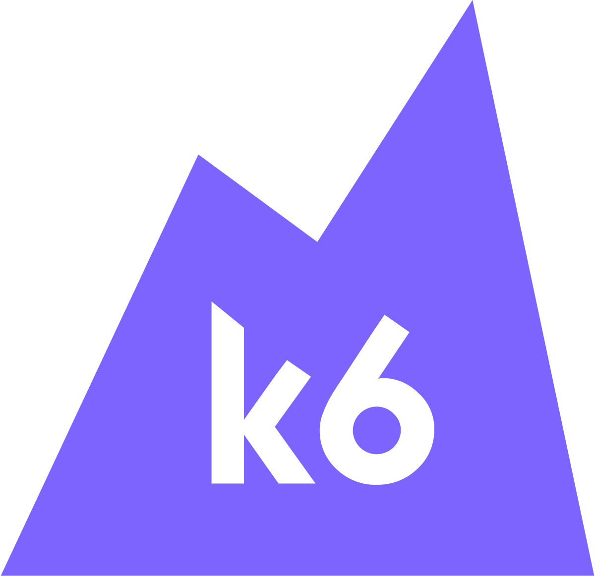
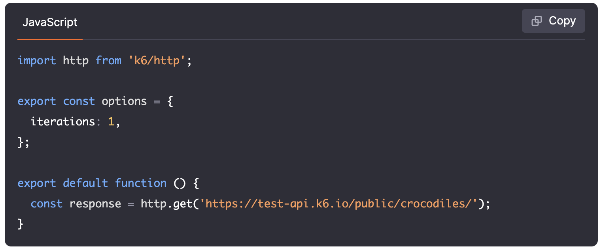

 

# Introduction to k6 



---

# Overview

1. What is k6 ?
2. What is Load testing ? 
3. Types of Load Tests
4. Automation of performance tests
5. Chaos and resilience testing
6. Infrastructure testing
7. QuickPizza Demo
8. Data-Gateway Current Workflow

---

# What is k6?

- Grafana k6 is an open-source, developer-friendly, and extensible load testing tool. k6 allows you to prevent performance issues and proactively improve reliability.

---

# What is Load Testing ?
- Load testing is the process of putting demand on a system and measuring its response.
- **Key Points**
    - Focuses on how well a system works under load.
    - Different from functional testing which checks if a system works.
    - Measures qualitative aspects like responsiveness and reliability.

---

# Why Do Performance Testing?

## Benefits:
- Improve user experience.
- Identify bottlenecks early.
- Prepare for unexpected demand.
- Increase confidence in the application.
- Assess and optimize infrastructure.
---

## Common Excuses & Counterpoints:

- "Our application is too small" → Even small systems benefit.
- "It's expensive/time-consuming" → Cost of not testing is higher.
- "Requires extensive technical knowledge" → Range of complexity available.
- "We don’t have a performance environment" → Alternatives exist.
- "The cloud is infinite" → Efficiency still matters.

---

# Load Testing vs. Performance Testing


```js 
                Performance testing != Load testing 
```

<h6>
- Performance testing verifies how well a system works as a whole, including aspects such as scalability, elasticity, availability, reliability, resiliency, and latency. </br> - Load testing is just one type of performance testing, and it is an approach that can be used to test many of aspects of application performance. However, not all performance testing involves load testing. </br>
- Load testing is a sub-practice of performance testing.
<h6>

---

# Load Test Scenarios

A load test scenario combines specific values of test parameters. Each scenario recreates a certain situation or set of conditions that the application will be exposed to.

Load test scenarios are often called load test types. Some of the most common scenarios are listed here.

---

- **Shakeout Test**: Small test to check for major issues.

---

- **Average Load Test**: Simulates typical production load.

---

- **Stress Test**: Simulates peak load conditions.

---

- **Soak Test**: Long-duration test to identify degradation over time.

---

- **Spike Test**: Simulates sudden traffic spikes.

---

- **Breakpoint Test**: Identifies the load level at which performance degrades.

---

# High-Level Overview of Load Testing Process

---

# Point of Refferences

- [Awesome k6](https://github.com/grafana/awesome-k6)
- [k6 OSS Workshop](https://github.com/grafana/k6-oss-workshop?tab=readme-ov-file#before-we-start)
- [Load Testing with k6](https://levelup.gitconnected.com/load-testing-with-k6-48488c7946bb)
- [Chaos testing with k6 and Friends](https://www.youtube.com/watch?v=2QHs_HEX7r0)

