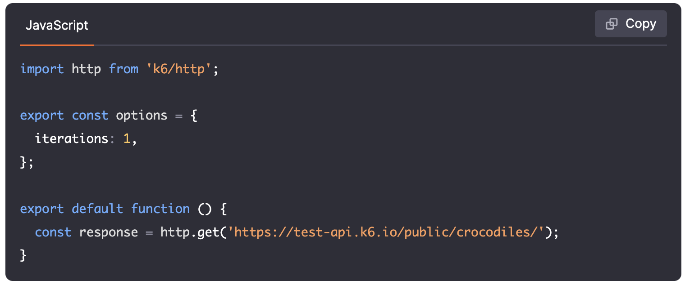
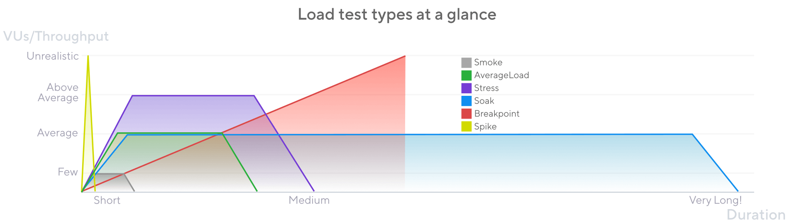
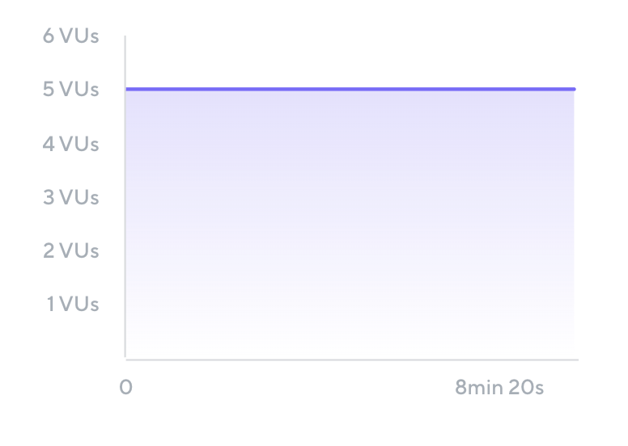
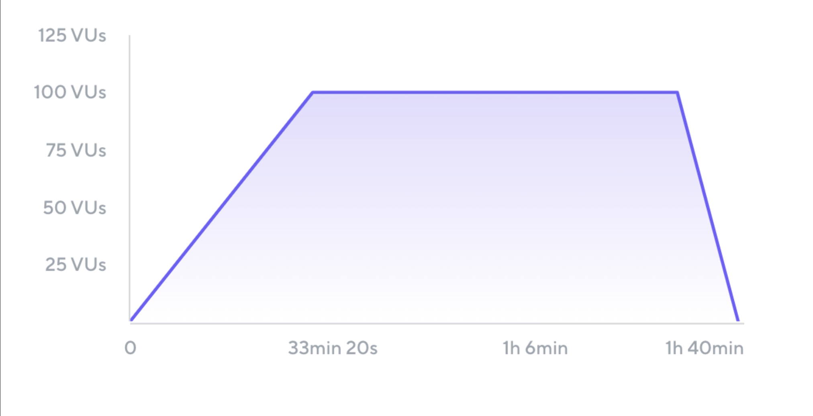
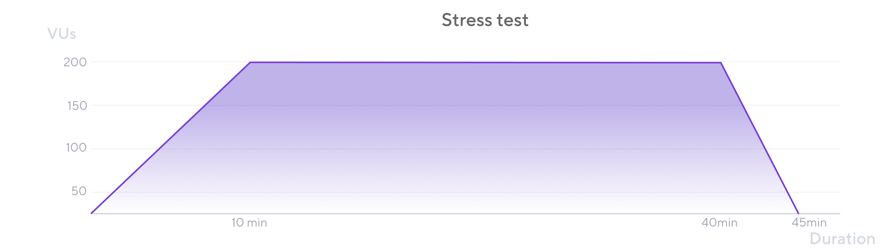
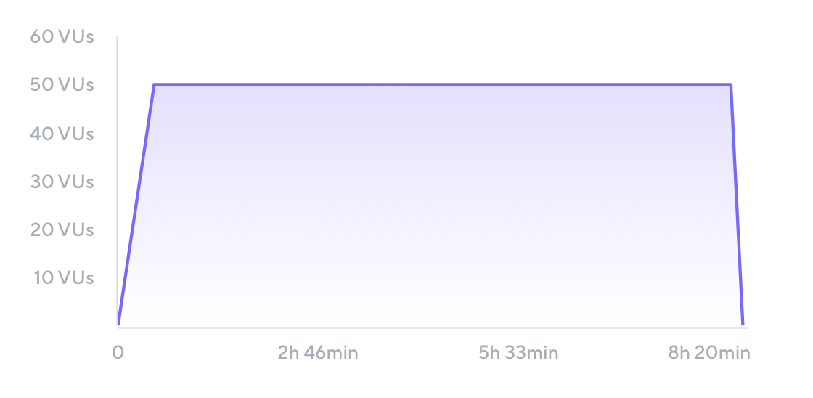
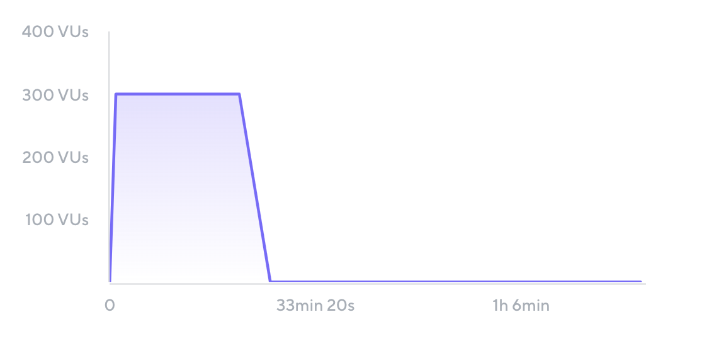
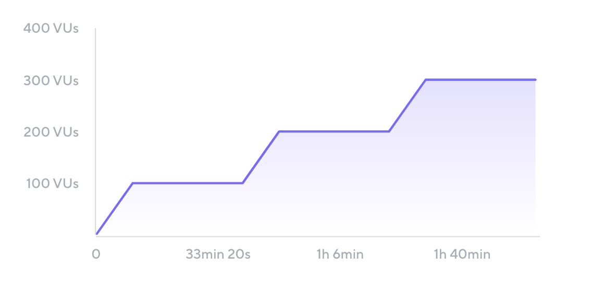

<!-- 
  -->

# Introduction to k6 



---

# Overview

1. What is k6 ?
2. What is Load testing ? 
3. Why Do Performance Testing?
4. Load Testing vs. Performance Testing
5. Load Test Scenarios/Types
6. QuickPizza Demo

---

# What is k6?

- Grafana k6 is an open-source, developer-friendly, and extensible load testing tool. k6 allows you to prevent performance issues and proactively improve reliability.

---

# What is Load Testing ?
- Load testing is the process of putting demand on a system and measuring its response.
- **Key Points**
    - Focuses on how well a system works under load.
    - Different from functional testing which checks if a system works.
    - Measures qualitative aspects like responsiveness and reliability.

---

# Why Do Performance Testing?

## Benefits:
- Improve user experience.
- Identify bottlenecks early.
- Prepare for unexpected demand.
- Increase confidence in the application.
- Assess and optimize infrastructure.

---

## Common Excuses & Counterpoints:

- "Our application is too small" → Even small systems benefit.
- "It's expensive/time-consuming" → Cost of not testing is higher.
- "Requires extensive technical knowledge" → Range of complexity available.
- "We don’t have a performance environment" → Alternatives exist.
- "The cloud is infinite" → Efficiency still matters.

---

# Load Testing vs. Performance Testing


```js 
                Performance testing != Load testing 
```


- Performance testing verifies how well a system works as a whole, including aspects such as scalability, elasticity, availability, reliability, resiliency, and latency. 

- Load testing is just one type of performance testing, and it is an approach that can be used to test many of aspects of application performance. However, not all performance testing involves load testing.

- Load testing is a sub-practice of performance testing.

---

# Load Test Scenarios

A load test scenario combines specific values of test parameters. Each scenario recreates a certain situation or set of conditions that the application will be exposed to.

Load test scenarios are often called load test types. Some of the most common scenarios are listed here.



---

##### Test parameters

This are the non-exhaustive list of common test parameters:

- **Virtual users (VUs)**:  1 VU's activity represents that of 1 real user.
<!-- A VU is an independent thread of execution that runs concurrently to other VU threads. -->
- **Iterations**:  The total number of repetitions of the script to be executed by the VUs.
- **Throughput**: A measure of how much load the test generates over time
<!-- , usually defined in VUs per second, requests per second, or iterations per second. -->
- **Load profile**:The shape of the traffic generated by the test over times.
- **Duration** : The time it takes to run the entire test and its individual stages.

---

##### Shakeout Test 

**Small test to check for major issues.**
Sometimes known as a smoke test, checks for major issues before spending more time and resources.

- Typically uses one or a few VUs that run for a short amount of time . If **test fails** any issues must be resolved first. 

```js
Name: Shakeout Test
Total VUs: 5	
Ramp-up: 0 seconds	
Duration: 10 minutes
Ramp-Down: 0 seconds
```



---

##### Average Load Test

 Simulates typical production load. Typically includes ramp-up and ramp-down periods to siumalet users gradually loggin in and interact with the system. 
 The test sustains the steady-state load siumlation for an hour or so.

 ```js
 Name: Average Load Test
Total VUs: 100	
Ramp-up: 30 minutes
Steady state: 60 minutes
Ramp-down: 10 minutes
Total duration: 100 minutes
```



---

##### Stress Test
simulates the traffic that the application is expected to experience at the highest point of the day or season. 

a good test scenario when testing rush hours or sale periods during which the application faces abnormally heavy load.



---

##### Soak Test : 

Soak tests, also called endurance tests, 

- Tests with a longer duration than average. 
- Some performance bottlenecks, such as ones caused by defects in memory management, appear only during longer periods of time. 

```js
Name: Soak Test
Total VUs: 50
Ramp-up: 30 minutes
Steady state: 480 minutes
Ramp-down: 10 minutes
Total duration: 520 minutes (8 hours and 40 minutes)
```




---

##### Spike Test : 

A spike test, recreates a situation where the application experiences a sudden and massive increase in traffic. Spike tests are good for simulating timed events like:

- product launches or sale of concert tickets
- deadlines (last days of tax submissions)

```js
Name: Spike Test	
Total VUs: 300
Ramp-up: 1 minute
Steady state: 20 minutes
Ramp-down: 5 minutes
Total duration: 26 minutes
```



---

##### Breakpoint Test : 
Identifies the load level at which performance degrades and build confidence in what a system can handle. 
The results from breakpoint tests provide valuable inputs for capacity planning.

```js
Name: Breakpoint Test	
Total max VUs: unknown
Ramp-up: 10 minutes before each stage
Steady state: 30 minutes
Ramp-down: 0 minutes
Total duration: unknown
```



---

# Demo by Grafana Labs

This demo is provided by grafana labs itself. Was named QuickPizza demo app. 

- [k6-workshop](https://github.com/aniqaqill/k6-oss-workshop)
- [QuickPizza](https://github.com/grafana/quickpizza)

Somehow k6-workshop need minor fix to run the test can view [this issues for solution](https://github.com/grafana/k6-oss-workshop/issues/4#issuecomment-2663246289)

---
# Sources

- [k6 Learn](https://github.com/grafana/k6-learn)
- [k6 OSS Workshop](https://github.com/grafana/k6-oss-workshop?tab=readme-ov-file#before-we-start)
- [Awesome k6](https://github.com/grafana/awesome-k6)
- [Load Testing with k6](https://levelup.gitconnected.com/load-testing-with-k6-48488c7946bb)
- [k6 Operator for K8s](https://github.com/grafana/k6-learn/blob/main/Modules/XX-Future-Ideas/How-to-use-the-k6-operator-for-Kubernetes.md)
- [Chaos testing with k6 and Friends](https://www.youtube.com/watch?v=2QHs_HEX7r0)
- [Basic k6 Load Testing Setup](https://youtu.be/XR2MAivt-9E?si=IlauKGqcsVKGx3rC)
- [Chai with k6](https://grafana.com/docs/k6/latest/testing-guides/use-chai-with-k6/)

