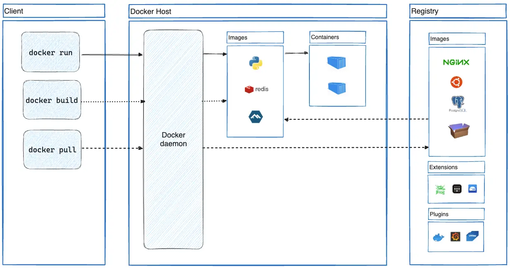

## Docker Architecture

From the picture below, we can see that Docker uses a **Client-Server Architecture**. Similar to my final year projects, haha. But this time, it’s for containers. The Docker daemon (`dockerd`) handles the hard part of running and distributing containers.



**Docker Daemon (`dockerd`)**  
- A background process that manages Docker objects (containers, images, volumes, networks, etc.).  
- Stores all Docker-related data in a single directory.  
- A daemon can also communicate with other daemons to manage Docker services.  

**Docker Client**  
- This is where users interact with Docker. When you use any Docker command, it is sent to the Docker daemon (`dockerd`).  

**Docker Registry**  
- Stores Docker images. Docker Hub is a public registry that anyone can use, and Docker looks for images on Docker Hub by default. You can even run your own private registry.  
- When you use the `docker pull` or `docker run` commands, Docker pulls the required images from your configured registry.  
- When you use the `docker push` command, Docker pushes your image to your configured registry.  

**Docker Objects**  

> The relationship between images ( Image) and containers ( ) is like that between and Containerin object-oriented programming - [refference](https://yeasy.gitbook.io/docker_practice/basic_concept/container#:~:text=The%20relationship%20between%20images%20(%20Image)%20and%20containers%20(%20)%20is%20like%20that%20between%20and%20Containerin%20object%2Doriented%20programming)


This mainly refers to the relationship between **images** and **containers** is like . Why? Because images are static definitions, and containers are running instances of those images. Containers can be created, started, stopped, deleted, paused, etc. But it’s not limited to that.  

**Docker Images**  
- Read-only templates used to create Docker containers.  
- Serve as the building blocks for containers.  
- Can be pulled from public or private repositories (e.g., Docker Hub).  

**Container**  
- A runtime instance of a Docker image.  
- Packages an application’s code, dependencies, and libraries.  
- Solves the "it works on my machine" problem by ensuring consistency across environments.  

Both images and containers use **layered storage**. This means if a container is deleted or destroyed, everything, including its storage layer, is lost. This layer should remain **stateless**.  

This is different from **Docker volumes**, which run independently of the container. Therefore, after using a data volume, the data will not be lost even if the container is deleted or restarted.  

A container is usually defined by an image.  

---

**Example:**  

Running Ubuntu and interacting with it via the CLI. This example is taken from the Docker Docs.  

```bash
docker run -i -t ubuntu /bin/bash
```

If you don't have the ubuntu image locally, Docker pulls it from your configured registry, as though you had run docker pull ubuntu manually.

1. Docker creates a new container, as though you had run a docker container create command manually.

2. Docker allocates a read-write filesystem to the container, as its final layer. This allows a running container to create or modify files and directories in its local filesystem.

3. Docker creates a network interface to connect the container to the default network, since you didn't specify any networking options. This includes assigning an IP address to the container. By default, containers can connect to external networks using the host machine's network connection.

4. Docker starts the container and executes /bin/bash. Because the container is running interactively and attached to your terminal (due to the -i and -t flags), you can provide input using your keyboard while Docker logs the output to your terminal.

5. When you run exit to terminate the /bin/bash command, the container stops but isn't removed. You can start it again or remove it.


