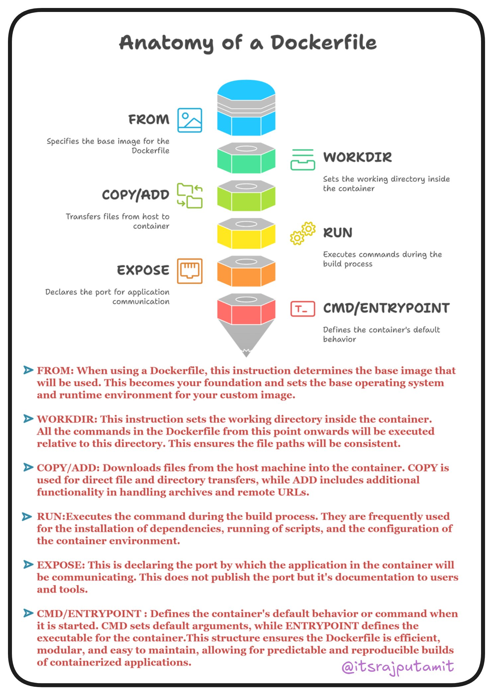

## Built a Dockerfile

When I first started to learn about Docker, I literally had no idea what was happening until I tried to do something with it. So, it's best to start with something. Well, creating your own Dockerfile will probably help you get started.

No worries if you don't understand anything yet. Because you probably won't until you try to get your hands dirty with it.

Just in case you haven't done it yet, [install Docker](https://docs.docker.com/engine/install/).

Let's get started.

As we can see, it consists of a few sections like **FROM, WORKDIR, COPY/ADD, RUN, EXPOSE, CMD/ENTRYPOINT**. Each of these has its own usage, as mentioned in the image.

So, I'm trying to understand what each of these actually does and what's the best way to initialize it. 

tbc..
