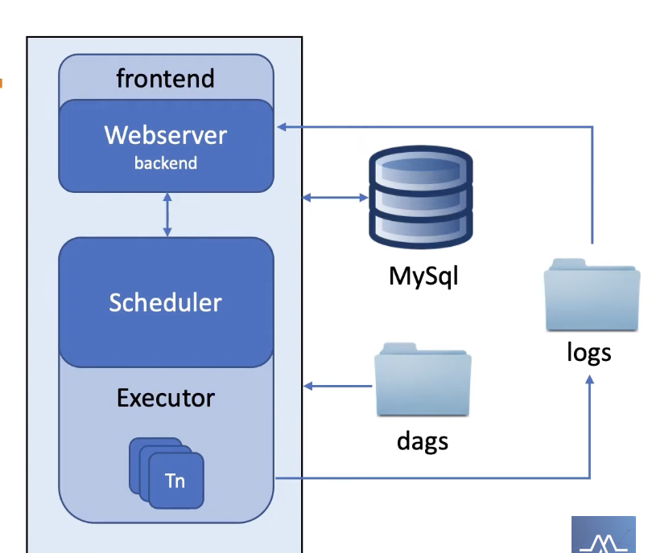

## Introduction

From this [playlist](https://www.youtube.com/playlist?list=PLzKRcZrsJN_xcKKyKn18K7sWu5TTtdywh)

### World Before Airflow
- Cron Job
- Python/Bash Script
It's a hassle if business requirements change ...
managing all those cron jobs is crazy.

Need to build a homemade orchestration system to monitor & maintain 100+ cron jobs

  

List of Challenges 
- Monitoring
- Manage Failures
- Dependencies
- Backfills
- Scalability
- Deployments
So Airflow does this hence we use it...

In Airflow it has Task 

  

DAG ( Directed acylic graph)

  

Mini Architecture

  

Airflow Usage
- Run ETL pipelines
- Data ingestion pipelines
- ML pipelines
- General purpose scheduling
Example of UI:

  

## Executors Architecture 

**Core Components**
- Scheduler - Trigger schedule workflows and submit tasks to executor to run
- Executor - Handles running tasks
- Worker - Runs the actual tasks
- Webserver - User interface to inspect, trigger and debug DAGs and task behavior
- Metadata DB - stores info about DAGs and task states
- DAGs folder - directory where all DAGs code is persisted, read by scheduler and executor

  

### Sequential Executors
- default
- runs within scheduler
- one task instance at a time
- sqlite recommended
- Pros - No Setup, Lightweight, Cheap
- Cons - Not Scalable, slow (one task at a time), single point failure, not suitable for prod

  

### Local Executors
- runs within scheduler
- multiple task instance at a time
- Pros - Easy to setup, Cheap & light, run multiple tasks
- Cons - Not suitable to scale, not suitable for prod, single point failure

  

### Celery Executor
- Runs tasks on dedicated machines
- Distributes Task queue
- Pros - built for horizontal scaling, fault tolerant, prod ready
- Cons - Takes time to setup, resource wastage if no task
- Not so cost effective

  

### K8s Executor
- Runs tasks on dedicated pods
- Uses k8s API to manage pods
- Pros - can scale to zero, fault tolerant, can assign resources to individual tasks
- Cost & Resource effective
- Cons - launching pods takes a few seconds, k8s knowledge required

  

